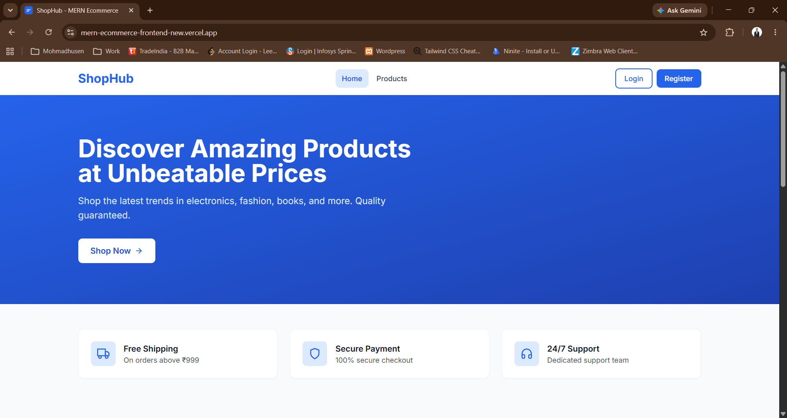
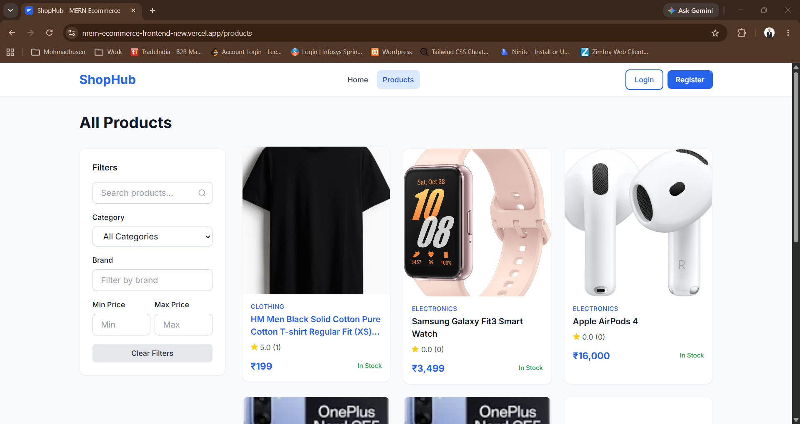
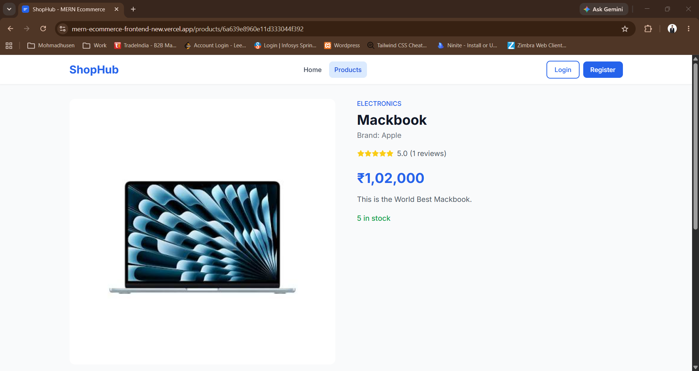
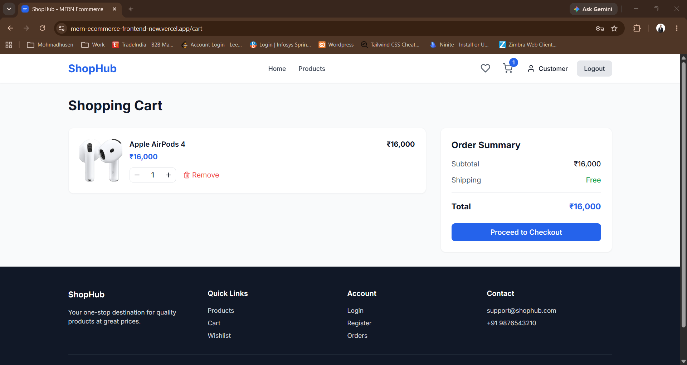
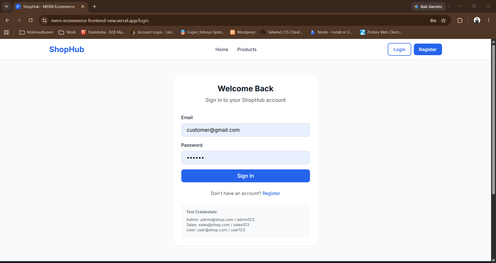
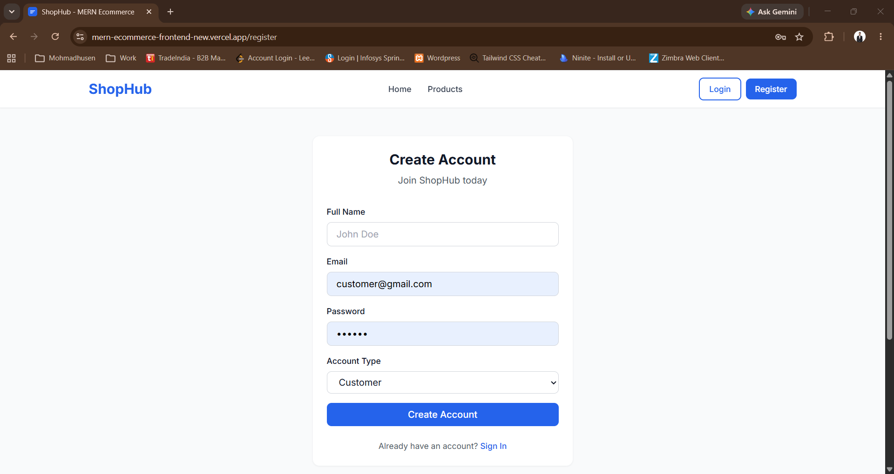
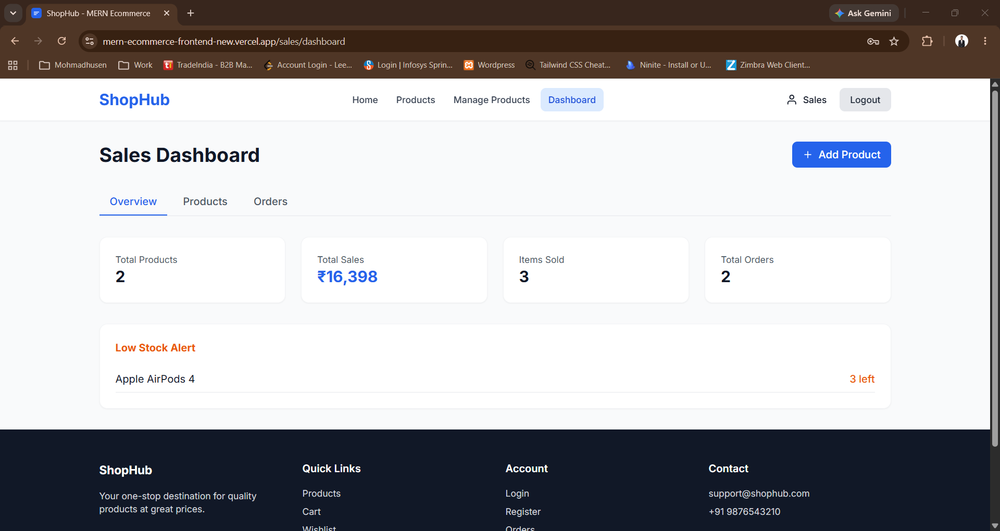
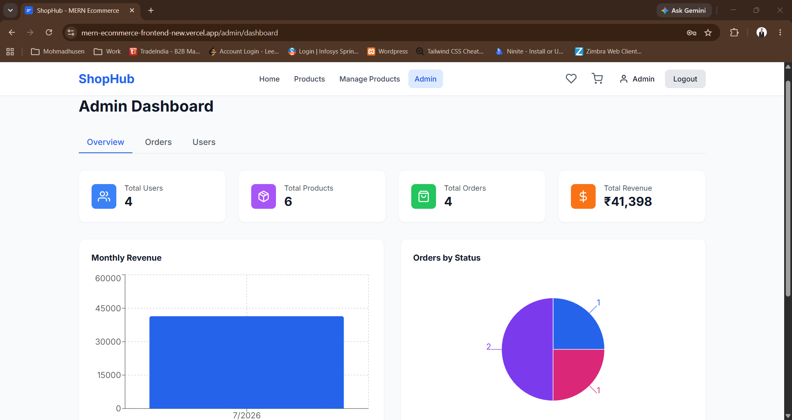

# 🛍️ Lumos MERN E-Commerce Platform

> A modern Full Stack MERN E-Commerce Platform built with React, Node.js, Express.js, MongoDB, JWT Authentication, Cloudinary, and Role-Based Access Control.


---

# 🚀 Live Demo

### 🌐 Frontend

https://mern-ecommerce-frontend-new.vercel.app/

---

# 📌 Project Overview

This project is a complete Role-Based MERN E-Commerce Platform developed during my Full Stack Development work.

The application provides three different user roles:

- 👤 Customer
- 💼 Sales
- 👑 Admin

Each role has different permissions and dashboards.

---

# ✨ Features

## 👤 Customer

- User Registration
- Secure Login
- JWT Authentication
- Browse Products
- Product Search
- Product Details
- Add to Cart
- Wishlist
- Place Orders
- Order History
- Responsive UI

---

## 💼 Sales

- Sales Dashboard
- Product Management
- Add Products
- Update Products
- Delete Products
- Manage Inventory

---

## 👑 Admin

- Admin Dashboard
- Manage Users
- Manage Sales Accounts
- Manage Products
- Role-Based Access
- Complete Platform Control

---

# 🔐 Demo Accounts

## 👤 Customer

Email:
```
user@gmail.com
```

Password
```
123456
```

---

## 💼 Sales

Email
```
sales@gmail.com
```

Password
```
123456
```

---

## 👑 Admin

Email
```
admin@gmail.com
```

Password
```
123456
```

---

# 🛠 Tech Stack

## Frontend

- React.js
- React Router
- Axios
- Tailwind CSS
- React Icons
- Vite

---

## Backend

- Node.js
- Express.js
- MongoDB
- Mongoose
- JWT Authentication
- bcryptjs
- Cloudinary
- Multer

---

# 📂 Folder Structure

```
mern-ecommerce
│
├── frontend
│   ├── src
│   ├── public
│   └── package.json
│
├── backend
│   ├── controllers
│   ├── middleware
│   ├── models
│   ├── routes
│   ├── config
│   ├── utils
│   └── server.js
│
└── README.md
```

---

# 🔑 Authentication

✔ JWT Authentication

✔ Password Encryption

✔ Protected Routes

✔ Role-Based Authorization

✔ Admin Middleware

✔ Sales Middleware

---

# ☁ Image Upload

- Cloudinary Integration
- Secure Image Storage
- Optimized Image Delivery

---

# 📦 Installation

Clone Repository

```bash
git clone https://github.com/your-username/your-repository.git
```

Go to project

```bash
cd your-repository
```

Install Frontend

```bash
cd frontend
npm install
npm run dev
```

Install Backend

```bash
cd backend
npm install
npm run dev
```

---

# ⚙ Environment Variables

Backend `.env`

```env
PORT=5000

MONGO_URI=YOUR_MONGODB_URI

JWT_SECRET=YOUR_SECRET

CLOUDINARY_CLOUD_NAME=YOUR_NAME

CLOUDINARY_API_KEY=YOUR_KEY

CLOUDINARY_API_SECRET=YOUR_SECRET
```

---

# 📸 Screenshots

## 🏠 Home Page



---

## 🛍 Products



---

## 📄 Product Details



---

## 🛒 Shopping Cart



---

## 🔐 Login



---

## 📝 Register



---

## 💼 Sales Dashboard



---

## 👑 Admin Dashboard



---

# 📈 Future Improvements

- Razorpay Payment Gateway
- Order Tracking
- Email Notifications
- Coupon System
- Analytics Dashboard
- Product Reviews
- Wishlist Sharing
- Real-Time Notifications
- AI Product Recommendation

---

# 🤝 Contributing

Contributions are welcome.

Fork the repository and create a Pull Request.

---

# 👨‍💻 Developer

**Mohmadhusen Khimani**

MERN Stack Developer

GitHub:
https://github.com/mohmadhusenkhimani

LinkedIn:
https://www.linkedin.com/in/mohmadhusen-khimani/

Portfolio:
https://mohmadhusenkhimani.vercel.app/

---

# ⭐ Support

If you like this project,

⭐ Star the repository

🍴 Fork the repository

📢 Share it with others

---

## Thank You ❤️
